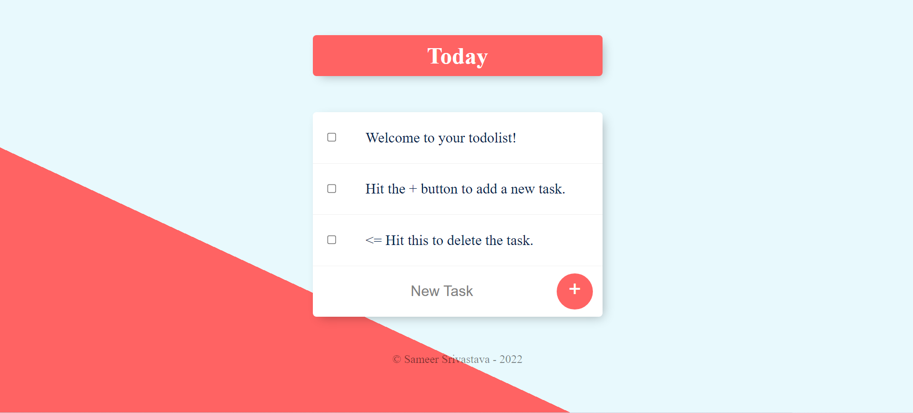

# Follow-along-ToDoList

Check it out on -> https://enigmatic-harbor-65158.herokuapp.com/

# ABOUT
This is a todolist made while learning about Node.Js & database management in backend. Here we used MongoDb as our database. this app is hosted on heroku and the dabase is hosted on MongoDB Atlas.

# TECHSTACK
HTML, CSS, JavaScript, Node.Js, MongoDB
